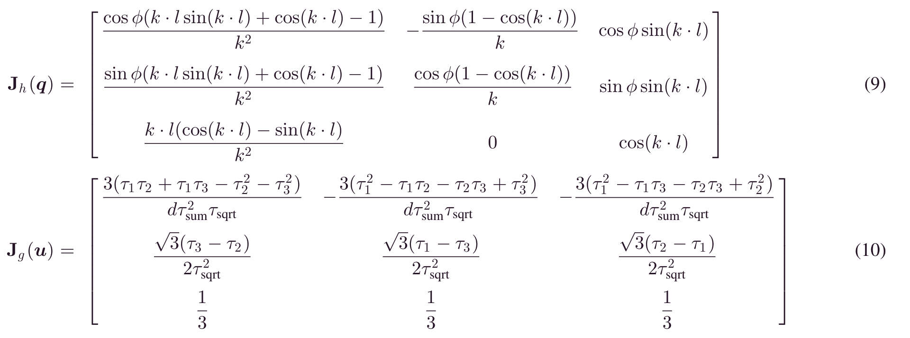
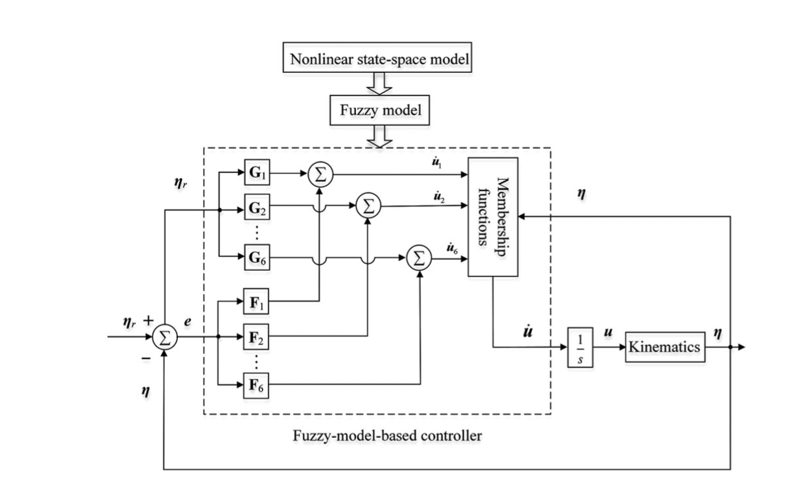
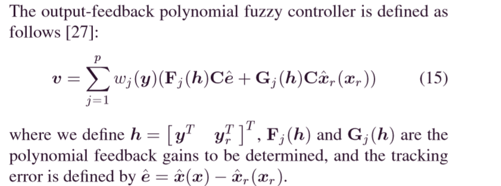

## Kinematic Control of Continuum Manipulators Using a Fuzzy-Model-Based Approach

### 摘要

近年来，连续型机械臂相关技术快速涌现和发展，然而由于数学模型的复杂性和建模的不精确性，开发有效的控制系统是一项特殊的挑战性任务。

首次尝试用基于模糊模型的方法对连续体机械手进行运动控制。模糊控制模型提出是为了自主执行连续性机械臂轨迹追踪任务。设计隶属函数将线性化的状态空间模型相结合，得到一个整体上的模糊模型，最后模糊模型用于模糊控制器中。这个控制方法需要的算力低——无需连续更新连续机械臂的雅可比行列式。

### Introduction

连续机械臂的主要特征是它们沿结构长度连续弯曲的能力。此外，由于其固有的柔软性（compliance），这些机械手还具有吸引人的灵活性，并允许在受限环境中进行安全交互。尽管连续体机器人学仍处于起步阶段，但当前大量研究集中在此类连续体机器人的硬件和机器学习方法的开发上，包括设计，建模，控制和学习。连续机器人操纵器已涉足不同领域的快速增长的应用，包括**工业运营**、**生命健康、家庭环境**。

与具有分段刚性链接的常规机械手相比，连续机械手的体系结构概念和致动原理有根本不同，他们经常模仿生物躯干的触角行为，并以类似于生物学角色模型的方式操纵物体，特别是，连续操纵器强调对各种物体的“全臂操纵”（whole arm manipulation），甚至**无需事先了解物体的形状**即可执行。

经常使用的连续体机械手结构是腱驱动tendon-driven的柔性骨架设计[6]，气动波纹管集成设计pneumatically ac-tuated  bellow-integrated  designs [7]，同心管设计concentric  tube  designs[8]以及具有局部驱动单元的软体结构soft body structures with locally actuated cells。不仅在设计方面而且在建模方面也取得了重大进展，包括运动学kinematics和动力学dynamics

Chirikjian在1990年代发表了他们关于连续机器人运动学和动力学的初步研究。Hannan和Walker使用完善的Denavit-Hartenberg惯例为连续机械手提供了通用的运动学模型，该方法采用了最初用于传统刚性连杆机械手的建模方法，以通过虚拟刚性连杆virtual rigid-link运动学建立连续运动学。其他方法专注于静态建模，可以根据弹性梁理论深入了解连续机械臂的力学。在不同的运动学模型中，基本方法是使用恒定曲率近似constant-curvature approximation。它提供了封闭形式的位置和速度运动学，这是实时控制和进一步运动计划的基础。

连续操纵器的机器人控制有几种不同的方法，Penning等人研究了任务空间和关节空间中的**闭环控制closed-loop control**，从而提高了机器手导管的终点定位精度。由于连续用户操纵器的非线性行为和高度灵活性，系统性能已显示出受益于闭环控制。

关于任务空间或联合空间控制的选择，通常，采用反馈回路直接将**任务错误最小化minimize task errors**的任务空间控制器显示出一些优势[14]。在运动控制与动态控制方面，应注意的是，嵌入**速度级运动学的运动控制velocity-level kinematics**是常用的[15] – [17]；**动态控制dynamic control**也已被研究[18]；但是，缺乏一种广为人知的高效连续机械手的动态模型会限制其实现。

在[19]中，考虑到稳态定位误差steady-state positioning errors和连续操纵器的不良动态行为undesirable dy-namic behaviors的问题，结合了位置反馈position feedback和模态空间控制器modal-space controller的组合控制系统被提出并证明是有效的。

在智能控制级别，作为[20]控制律的一部分，引入了分布式模糊控制器，它避免了非线性积分-微分方程的复杂性所确定的困难。

最近，在[21]中提出了一种模糊逻辑方法来设计一种非线性控制器，以将连续操纵器的末端执行器调节到恒定的期望位置。

此外，基于神经网络的跟踪控制器已被广泛应用于连续机械手[22]，并且不需要精确的机械手动力学模型。

在[23]中，实现了一种自适应神经网络控制器，可以实时，高精度地实现末端执行器位置跟踪控制。

同样，考虑到连续操纵器与未知障碍物和环境相互作用的情况，仅基于实时雅可比行列式的经验估计empirical estimates而无需使用模型的任务空间闭环控制器task space closed-loop controller可用于克服这些干扰

在未来连续操纵器的存在下，我们预见自主执行的命令追踪任务基于实际控制策略practical control strategies将更接近新的应用。

最近，在心脏跳动的心脏导管手术中，导管运动控制器的实现令人印象深刻[25]，[26]。

在本文中，我们提出了一种基于模糊模型的方法来控制连续机械手。控制器基于稳定性分析，并为一般连续时间非线性系统设计。我们首先导出运动学模型，并分析其连续状态空间模型。然后，通过使用局部逼近技术建立了一个模糊模型来表示该状态空间模型。我们基于[27]中提出的稳定性条件设计模糊控制器。该控制器使我们的连续体操纵器的状态能够跟踪所需的参考模型reference model。基于Lyapunov稳定性理论，这个基于模糊模型的方法可以根据$H∞$抑制追踪误差。与在实时控制中高度依赖模型精度的开环前馈控制相比，我们的闭环控制已经足够适应在线轨迹调整并具有有效的轨迹跟踪功能。虽然通常在建立的模糊模型和物理非线性模型之间存在一定的建模误差，但是指定跟踪任务的稳定性和性能仍然可以实现。比起其他（伪）逆雅可比运动学控制系统，这个方法不需要在线更新雅可比，也不依赖于雅可比连续更新的估计。它响应传感器输入，同时为连续机械臂的运动控制问题提供一个闭式的低运算复杂度的解决办法。

据我们所知，这是第一个被提出的关于基于模糊控制的连续操纵器的任务空间闭环控制方法。

- 第二节介绍了在恒定曲率近似下的一般连续性机械手运动学。

- 第三节介绍了基于模糊模型的运动学控制方法，并开发了模糊控制器

- 在第四节中，给出了仿真示例，以说明所提出控制器的可行性和优点。
- 第五节报告了使用快速原型连续操纵器rapid-prototyped continuum manipulator在实时跟踪任务中对控制器的演示[29]。
- 为了比较，还实现了另外两种传统的基于雅可比的控制方法。第六节给出结论性意见和未来工作计划。

### 第二节

在本节中，我们概述了基于恒定曲率的连续机械手运动学。派生的模型构成了机器人控制器开发的基础。恒定曲率弧近似已经常应用于许多连续机械手的运动学建模[11]。在[5]中对产生恒曲率正向运动学等效结果的不同建模方法进行了综述和统一。由于其简化了模型，因此可以实现执行器输入和电弧参数之间的解析闭合形式关系，对实时控制很有用。

连续操纵器的弹性弯曲特征导致运动学分解为两个子映射，两个子映射与配置变量链接在一起（见图1）。为了简化表示法，我们在本文中删除了随时间变化的变量表示法。

图：用恒曲率理论建模的连续机械臂的运动学映射及其分解

这两个分解的子映射部分分别由特定于操纵器的运动学g：Rn→Rn，u→q和独立于操纵器的运动学：Rn→Rn，q→η描述。前者会随不同的驱动方式而变化（尽管有时某些通用的驱动策略之间存在一定的相关性），而后者则是完全通用的，并且在恒定曲率的假设下适用于连续机械手的所有各个部分。因此，根据由f = h（g（·））给出的执行器状态来计算末端执行器的位置η的完整运动学映射。函数h和g形成链接过程，函数g的输出作为函数h的输入

在不限制一般性的前提下，选择执行器空间变量作为最直接的执行器-肌腱驱动的设计，在这种设计中，弧线是由钢筋束形成的。在此，将三个腱长写成向量form u = [τ1，τ2，τ3]

弧度参数表示为：曲率 k 旋转角 φ，和边长度 l，可以计算出圆弧的弯曲角度θ和半径r。q = [k（u），φ（u），l（u）] T。

图：在（a）2-D空间和（b）3-D空间弯曲的连续机械手的示意图。说明了配置变量和不同的坐标系

此外，弧的几何形状提供了关系θ＝ k·l 和 r ＝ 1 / k，这使得能够计算出弧弯曲角θ和半径r。我们可以得到控制器末端的具体位置为：η=[x, y, z]T

#### A. 坐标系

通过不同的坐标系选择，导出的运动学映射将在形式上多种多样。为了描述末端执行器在空间中的位置，必须首先建立参考坐标系。

为了方便起见，参考坐标系{xyz}固定在连续操纵器的近端，其z轴与弯曲操纵器的主干曲线相切并指向远端。xy平面垂直于弯曲平面

弯曲系统{xbybzb}的定义应使连续机械手始终在xbzb平面中弯曲。原点Ob与原点O和zb轴一致，与z轴共线。

末端执行器坐标系{xeyeze}附加到连续机械手的尖端。尖端横截面的中心处的原点Oe，ze轴是和与机械臂主干曲线相切，或等效于尖端横截面的法线。为方便起见，xeze平面与弯曲平面xbzb共面。

#### B与机械手无关的子映射

一旦建立了上述坐标系，就将推导与操纵器无关的子映射的问题转换为求解数学模型，以描述相对于参考坐标系{xyz}的末端执行器坐标系{xeyeze}。因此，可以将参数化的齐次变换用作

oTe(q)是一个$4\times4$的齐次变换矩阵，由几部分组成，首先是oRe(q)是$3\times3$的旋转矩阵，ope(q)是一个$3\times1$的位置向量。

齐次变换矩阵的每个分量的推导如下：

其中描述坐标系{xbybzb}相对于参考坐标系{xyz}的一个同类变换矩阵是：

另一个描述相对于坐标系{xbybzb}的坐标系{xeyeze}是

位置向量bpe（k，l）可以被写为：

这样我们就完成了基于齐次变换的独立于机械臂的子映射的推导。

#### C 雅可比行列式

雅可比行列式是关于前向运动学的时间的偏导数的多维形式。它揭示了速度级的前向运动学，即推动器速度对末端执行器的空间速度的影响。下面是上文给出的前向运动学建模公式：

速度运动学推导为

这样得出的雅可比矩阵等于

其中J（u）是随时间变化的3×3矩阵，在上式中，雅可比行列式的左侧分量代表与操纵器无关的部分的Jh（q），右部是代表运动学中与操纵器无关的部分的Jg（u）。

我们得到的显式雅可比矩阵分别为（9）和（10）：

### 第三部分

运动学控制任务分目标是找到一个解，让致动空间的变量使得连续体机械手/人的末端能够跟踪理想的轨迹，下图是本文提出的任务空间闭环跟踪控制系统：

使用 基于模糊模型的运动学控制方法 构建的一个闭环跟踪控制系统的概览如图，其中$\eta_r$ 表示在任务空间内，理想的末端轨迹。Gi和Fj表示反馈增益， $\dot{x}$ 表示x对时间的偏导，$\dot{u}$则表示的是末端的运动速度。返回信息需要通过位置传感器得到。

具体的控制综合分为以下几个部分。重点在A

#### A.基于多项式模糊模型稳定性条件

本章的内容也是基于[27]总结出来的方法论

##### 1.多项式模糊模型

为了应用 基于多项式模糊模型稳定性分析，首先构建一个多项式模糊模型来表示连续体机械人/手的系统状态模型。通过用隶属度函数混合局部多项式模型来构建多项式模糊模型。描述一般非线性模型行为的P规则多项式模糊模型可以定义为

x表示系统状态向量，y表示输出向量，wi（y）是归一化隶属度，Ai（x）和Bi（x）是已知的多项式系统和输入矩阵

##### 2.参考模型

参考模型在数学上描述了所需的轨迹。它由用户指定，随后在基于模糊模型的稳定性分析中用于连续机械手的跟踪控制。参考模型的定义如下:

##### 3.输出反馈多项式模糊控制器

轨迹跟踪的基本思想是不断减少所需位置和实际位置之间的差异。此处采用多项式模糊控制器来跟踪轨迹，而无需在线计算（伪）逆雅可比矩阵。该模糊控制器是基于并行分布补偿的概念设计的.输出反馈多项式模糊控制器定义如下：

重要！！！！这个就是模糊控制器

**输出反馈多项式模糊控制器**定义为

##### 4.跟踪控制的 H∞性能指标

跟踪性能可以由H∞性能指标控制，用户可以对其进行调整以最大程度地减小跟踪误差（15）。它源自基于Lyapunov的稳定性分析。跟踪控制的H∞性能定义如下[27]：

#### B.状态空间的表示

上文推导的雅可比方程中揭示了速度层级的运动学：

从控制方面来说，系统的数学描述为：

其中方程被称为状态空间模型，并且u = g-1（h-1（η））可以通过求解它们的正向运动学的各个部分来解析地获得。通过在时域中替换上述状态空间模型，使状态空间控制器设计技术（例如[27]，[28]）朝着用于连续机械手的动态系统发展

#### C.通过局部逼近技术构建模糊模型

为了用模糊模型表示上面提到的连续体机械臂的状态空间模型，本文使用局部逼近技术。

**接下来本文举了一个例子，限定了具体的坐标范围，展示构建模糊模型的过程**

根据例子中的数据，作者设计了6个系统状态来近似状态空间模型。事实上，可以设计更多的状态来建立更精确的模糊模型，但这也将导致更高的计算复杂度。

然后可以得到关于每组系统状态的局部状态空间模型为：

接着本文定义了六个模糊规则以平滑地组合它们以形成整体模糊模型：

同时为了实现六个独立模糊规则之间的转换，提出以下隶属函数

从而推出这些本例状态空间模型的隶属度函数：

**从而得到模糊模型**：

然后就可以计算原始的状态模型和构建的模糊模型之间的误差，并实现模糊控制

#### 四、模拟与仿真

作者在MATLAB仿真中实现了所提出的模糊控制器来研究其性能。在仿真中使用了两种不同类型的参考模型，分别描述了直线和椭圆跟踪轨迹

首先是直线的跟踪轨迹：

任务空间中连续操纵器尖端的轨迹，并用蓝线表示。绿点表示初始位置，红点表示终止位置，绿点虚线表示指定的参考轨迹

我们可以看到，所提出的模糊控制器有效地完成了轨迹跟踪任务。

总共四个控制器之间的性能比较如图1b所示：

蓝色，黑色，青色和粉红色轨迹分别表示基于控制器“ I-A”，“ I-B”，“ I-C”，“ I-D”的轨迹

结果显示在表一中，它们进一步说明了所提出的模糊控制器的优越性。

- 整数绝对误差（IAE）

- 时间的积分乘以绝对误差（ITAE）
- 输入的绝对值的积分（IAV）

接着对于椭圆轨迹跟踪任务：

如上图a可以看到通过设计的模糊控制器可以完美地完成椭圆跟踪任务。

四个控制器的比较也在上图中展示出来：我们可以看到，尽管基于开环和闭环雅可比控制器的实际轨迹都是椭圆形的，但是它们在起始位置之后很快就偏离了定义的椭圆形。

下表进一步显示模糊控制器的优越性：

如IAE和ITAE所示，所提出的具有最低成本的模糊控制器可提供最佳性能。

#### 五、结论和未来工作

本文提出了一种模糊控制器，用于自主执行连续型机械臂的轨迹跟踪任务。克服了困扰其他类型控制器的模型复杂性和不确定性问题。在MATLAB仿真中，所提出的控制器已实现并与其他三个已有控制器进行了比较。结果表明，所设计的模糊控制器在最小跟踪误差方面具有最佳性能，并且可以高效地完成这两种跟踪任务。其他基于Jacobian的控制器遭受模型不正确的困扰。

当推导控制器增益时，所提出的模糊方法具有很高的计算复杂度，需要高性能的计算机来解决。在推导控制器时，本文没有使用精确的原始非线性模型，并且需要更多的规则来实现更精确的模型。因此，在更好的性能和更多规则之间找到平衡至关重要。

未来的工作包括：

1. 进一步完善控制器的设计，并使用实际的连续机械臂系统对控制器进行测试。
2. 将来在动力学模型和弹性材料的滞后问题上的工作将有助于进一步理解和控制此类连续机械臂。