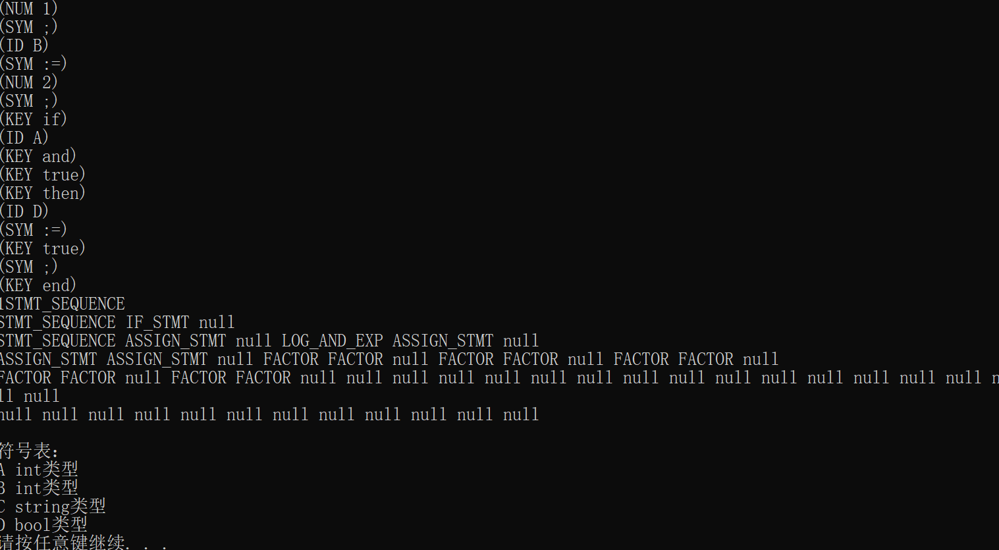
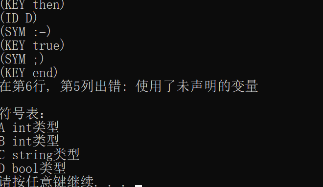

## 词法分析实验报告

### Tiny+语言词法

#### 一、关键词(KEY)

Tiny+中可能出现的关键词包括以下这些

```C++
// 定义语法中所有可能出现的关键词
bool Token::is_KEY(string& str) {
	return str == "true" || str == "false" || str == "or" ||
		str == "and" || str == "not" || str == "int" ||
		str == "bool" || str == "string" || str == "while" ||
		str == "do" || str == "if" || str == "then" ||
		str == "else" || str == "end" || str == "repeat"
		|| str == "until" || str == "read" || str == "write";
}
```


#### 二、特殊符号(SYM)

常见特殊符号包括以下这些，其中注释用大括号包括。

```C++
// 判断是否为特殊符号
bool LexicalAnalysis::is_special_symbol(char c) {
	return c == ':' || c == ',' || c == ';' ||
		c == '<' || c == '>' || c == '=' ||
		c == '+' || c == '-' || c == '*' ||
		c == '/' || c == '(' || c == ')' ||
		c == '{' || c == '}';
}
```

其中单引号包括起来的是字符串，需要特殊考虑。在处理单引号包括的内容时，我们不做任何处理，并维持当前单引号状态


#### 三、标识符(ID)

标识符由非数字开头的字符串，用来代表变量名等。


#### 四、空白(blank)

Tiny中常见空白包括：空格（0x20）、水平制表（0x09）、垂直制表（0x0B）、换页（0x0C）、回车（0x0D）和换行符（0x0A）


### 语义分析实验

#### 一、实验目的

语义分析本质上就是在语法分析的基础上进一步完善分析的功能。举个例子来说，在语法分析部分的if_stmt函数中，在语义上判断条件必须返回布尔类型的值，因此我们加入一个判断，判断是否结果为布尔类型，如果不是的话就抛出异常。


#### 二、实验原理

语义分析的核心就是在语法分析的基础上对特定的语义规则进行分析，并指出出现异常的地方。我们首先需要定义一个符号表，用来统计已经声明的变量：

```C++
// 定义符号表
struct Sym {
	Token tk;			// 符号
	ObjType obj_type;	// 对象类型
	ValType val_type;   // 值类型
};

class SymTable {
private:
	map<string, Sym*> table_;
public:
	Sym* insert(string name);
	Sym* find(string name);
	void del(string name);
	void print();
};
```

我们定义一张符号表，他基于map实现，我们将ID的字符串名称和对应的符号联系起来。这样我们就可以在分析后面的句子时，通过查阅符号表观察变量类型和变量是否被声明过等问题，解决一些语义上的问题。我们通过修改语法分析中的declaration函数来收集符号表的内容：

```C++
// tiny 语法中声明都要放在前面，这些不作为语法分析的内容
void GrammarAnalysis::declaration() {
	// 跳过类型声明符号int、bool、string
	while (match({ tokenKind::TK_INT, tokenKind::TK_BOOL, tokenKind::TK_STRING })) {
		// 记录当前token的类别
		ValType val_type;
		if (token_it_->GetKind() == tokenKind::TK_INT)
			val_type = ValType::VT_INT;
		if (token_it_->GetKind() == tokenKind::TK_BOOL)
			val_type = ValType::VT_BOOL;
		if (token_it_->GetKind() == tokenKind::TK_STRING)
			val_type = ValType::VT_STRING;

		// 循环匹配多个变量，不同变量用逗号分隔
		do {
			++token_it_;
			match({ tokenKind::ID }, "类型声明符号后面需要跟变量名");

			// 在符号表中插入该变量
			Sym* sym = sym_table_.insert(token_it_->GetValue());
			if (sym == NULL) throw ErrorMsg(token_it_->GetLine(), token_it_->GetColumn(), "标识符已经存在");
			// 记录变量类型variable
			sym->obj_type = ObjType::OT_VAR;

			// 记录值类型 int bool string
			sym->val_type = val_type;

			// 记录当前token
			sym->tk = *token_it_;	

			token_it_++;
		} while (match({ tokenKind::TK_COMMA })); //匹配逗号
		match({ tokenKind::TK_SEMICOLON }, "变量声明最后应该加';'"); //匹配分号
		++token_it_;
	}
}
```

在Tiny语言中，使用变量前我们需要对变量进行声明，因此没有声明的变量在后面被使用的话是一个非法的行为，这就是语义检测的一个功能，我们在factor函数中，会对因子进行分析，也就是NUM/STR/TRUE_FALSE/ID这些。在检测ID的时候我们没有判断这个变量是否被声明过，因此我们这里可以修改该函数，加上一些判断语句：

```C++
// 判断ID是否在使用之前进行了声明，如果没有声明抛出异常
if (!sym_table_.find((*token_it_).GetValue()))
	throw ErrorMsg((*token_it_).GetLine(), (*token_it_).GetColumn(), "使用了未声明的变量");
```

如果该变量没有出现在sym表中，说明没有被声明，因此就会出现异常。


#### 三、实验结果

正常情况下，我们会正确的分析源程序并输出一张符号表。用以下代码进行实验：

```c++
int A,B; {define int}
string C; {define string}
bool D; {define bool}
C:='hello world'; {assign string}
A:=1;
B:=2;
if A and true then
	D:=true;
end
```

可以看到下面的结果正常输出了出来，ABCD的数据类型都正确。



但假如我们修改源程序为：

````c++
int A,B; {define int}
string C; {define string}
bool D; {define bool}
C:='hello world'; {assign string}
A:=1;
B:=2;
if H and true then
	D:=true;
end
````

将if的条件改成H，此时编译器就会提示错误：



H变量没有声明，因此出现了错误。


### 中间代码生成

#### 一、实验目的

实验要求将源代码翻译成三地址的中间代码


#### 二、实验原理

##### 1. 三地址代码

三地址代码中，一条指令的右侧最多只有一个运算符，也就是说，不允许出现组合的算术表达式 。在翻译过程中会产生临时的表达名字。 三地址代码拆分了多运算符算术表达式以及控制流语句的嵌套结构，所以适用于目标代码的生成和优化。因为三地址表达式用名字来表示程序计算得到的中间结果，所以可以方便地进行重组。 

三地址代码基于地址和指令，地址其实通俗的理解就是变量名，指令其实就是运算符。常见的三地址指令形式如下：

  

我们就拿简单的if-then-else的形式做一个简单的分析。对于代码：

```C++
do i = i +1 ; 
while(a[i] < v)；
```

可以翻译为三地址符号为：

```
L:	t1 = i + 1
    i = t1
    t2 = i*8
    t3 = a[t2]
    if t3 v goto L
```


##### 2. 中间代码生成实现

我们拿if-then-else来看实现过程：

```C++
// 处理if节点
void IntermediateCode::if_node(TreeNode* root, string end_label) {
	string before_else_label = end_label;
	string before_then_label = get_new_label();
    // 判断是否有else的内容
	if (root->child_[2]) {
		before_else_label = get_new_label();
		cond_exp(root->child_[0], before_then_label, before_else_label);
		res_.push_back("Label " + before_then_label);
		stmt_seq_node(root->child_[1]);
		res_.push_back("goto " + end_label);
		res_.push_back("Label " + before_else_label);
		stmt_seq_node(root->child_[2]);
	}
	else {
		cond_exp(root->child_[0], before_then_label, end_label);
		res_.push_back("Label " + before_then_label);
		stmt_seq_node(root->child_[1]);
		res_.push_back("Label " + end_label);
	}
}
```

可以看到，我们分情况讨论是否有else的情况。假如现在是没有else的情况：res存放我们生成的中间代码结果。我们首先分析then前面的条件语句，然后打上标签，接着我们递归的调用入口函数stmt_seq_node去分析then和end之间的逻辑代码，最后为这段逻辑代码，打上标签Label。


#### 三、实验结果

我们拿一个实验结果来看。我们将实验代码简化为只有if-then-else，假如我们的目标代码为：

```c++
int A,B; {define int}
bool D; {define bool}

if D and true then
	A:=1;
end
```

我们生成的中间代码为：


if的条件有两个条件，因此我们调用cond_exp后，他内部还会递归的再调用一次自身。这样就形成了一个goto的链路，如果同时满足两个条件，就会沿着链路一直跳转。接着程序在res中打上标签，然后对then后面的内容递归的分析。最后打上一个结束标签，如果不满足条件就会直接跳转结束标签。


#### 四、参考资料

- 实验参考了华南理工大学的编译原理实验ppt及书本，以及github上一些已有分享资料

- 参考网络tiny+语言编译原理教程